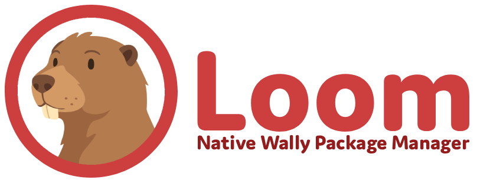
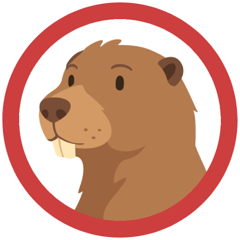

<h1 align="center">Loom, native <a href="https://github.com/upliftgames/wally">Wally</a> package manager for Roblox Studio</h1>

Loom is a native package manager for Roblox Studio that imports and manages Wally packages directly inside the editor.
Loom is a Roblox Plugin which was created for those unfamiliar with [Rojo](https://rojo.space/), with its simple injection of packages which follow rojo's code structure (.client.luau, .server.luau, etc..).

___
# About
## About Wally

Wally is a package manager built specifically for the Roblox ecosystem, similar to npm for JavaScript or Cargo for Rust. It allows developers to easily discover, install, and manage reusable code libraries, known as packages, from a centralized registry.

Instead of manually downloading and updating dependencies, Wally handles package installation and version management automatically. This ensures everyone on a team uses the same package versions, reducing compatibility issues and making collaboration much easier. Wally is especially useful alongside Rojo, which enables file system based Roblox development and has become a standard tool for modern Roblox workflows.

## About Loom

Loom brings the power of Wally directly into Roblox Studio, with no command line tools or external setup required.

Loom is a Roblox plugin that makes package management simple for developers who prefer working entirely inside Studio. It provides an easy way to browse, install, and manage Wally packages through a visual interface. Loom also understands Rojo's project structure, supporting file types such as .client.luau, .server.luau, and other context-specific scripts automatically.

This allows developers to use modular code and package management without changing their workflow or learning additional tools. Loom helps bridge the gap between traditional Roblox Studio development and modern software engineering practices, making it easier for both individuals and teams to build organized, scalable projects.

____
# Usage
To come..

____

# Acknowledgements
I want to give thanks to the users and thier resources toward the making of **Loom**

**Graphical Design** ( [J4KEWasNotHere](https://github.com/J4KEWasNotHere) )

- All visuals and graphics were designed in
 [ Photopea](https://www.photopea.com/)
- Font, [Domus-Extra Bold by _no-one_](https://fonnts.com/font_weights/domus_extrabold-otf/) on [**fonnts.com**](https://fonnts.com/)

**Backend** ( [J4KEWasNotHere](https://github.com/J4KEWasNotHere) )

- Plugin Framework is a modified reposity of [ **PluginEssentials** by mvyasu](https://github.com/mvyasu/PluginEssentials) accompanied by [**Fusion 0.2** by elttob](https://elttob.uk/Fusion/0.2/)
- Decompression of files, [ **ZZLib** by zerkman](https://codeberg.org/zerkman/zzlib)

#  License & Holder Agreement
Loom is available under the <kbd>MPL-2.0 License </kbd>. Terms and conditions are available in [LICENSE.txt](https://github.com/J4KEWasNotHere/Loom/blob/main/LICENSE) or at the [Official Website](https://www.mozilla.org/en-GB/MPL/2.0).

With respect of </b>[@UpliftGames](https://github.com/UpliftGames)</b>, and <kbd>[ Wally's License (MPL-2.0 License)](https://github.com/UpliftGames/wally/blob/main/LICENSE.txt)</kbd>. I hereby consent to any actions or modifications, including deletion, that they may make toward <kbd>[  J4KEWasNotHere/**Loom**](https://github.com/J4KEWasNotHere/Loom)</kbd>.

____

#### TODO:
* Implement Documentation using [Docusaurus](https://docusaurus.io)
* Create Devforum Topic
* Publish Plugin to Marketplace
* Plugin Version Control
